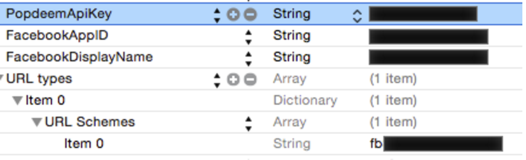

# Facebook App Setup

*In some cases, Popdeem will handle Facebook app registration for clients, to minimise integration time for client.*
Skip to [Trigger Login Flow](https://github.com/Popdeem/Popdeem-SDK-iOS/tree/master/Docs/login_flow.md "Login Flow")  

---

If your application does not already use Facebook Login, you will need to set up a Facebook application at the Facebook Dev Centre. You can do so by following this [Tutorial](https://developers.facebook.com/docs/apps/register "Facebook Tutorial"). You will need some details from your project first:

* Your App Identifier - This is found in your XCode Project. It will look something like this: It will look something like this: com.yourcompany.popdeemApp

---

Inside your Facebook Application, you will need to set up some custom Open Graph Objects in order to use Popdeem correctly. You will need two objects:

* Brand Location, which inherits from **Place** and has an attribute **Geopoints**  
* Photo, which inherits from **Photo**

You then need to create *two* Open Graph stories using these objects:

* **Check in** at **Brand Location**. This has action type **Check In**, object type **Brand Location** and uses the **Map** attachments, with **brand_location.geopoints** highlighted.
* **Share** a **Photo**. This has action type **Share**, and object type **Photo**.

---

Popdeem requires that your Facebook application is approved for the "publish_actions" permission. We use this permission when the user shares content on Facebook.

---

As per the Facebook documentation, in your *info.plist* file in your XCode Project, add the following key-value pairs:

```
    "FacebookAppId": YOUR_FACEBOOK_APP_ID
    "FacebookDisplayName" : YOUR_FACEBOOK_APP_DISPLAY_NAME
```

Then, you need to add an Array called "URL Types". Inside you put a Dictionary, with an Array for Key "URL Schemes". Inside the Array you need to add a string of "fb" followed by your Facebook App ID. The info.plist file should look like the image below:

  

---

*Note*  
If you use Facebook login inside your application, we suggest that you request the following permissions on login: "user_posts", "user_friends", and “user_education_history”. We use these items to enable Influencer Identification. Adding these at login will result in a smoother experience for the user when using the Popdeem service inside your application.

---

Next, [Trigger Login Flow](https://github.com/Popdeem/Popdeem-SDK-iOS/tree/master/Docs/login_flow.md "Login Flow")

---
[Docs Home](https://github.com/Popdeem/Popdeem-SDK-iOS/tree/master/Docs/README.md "Docs Home")
